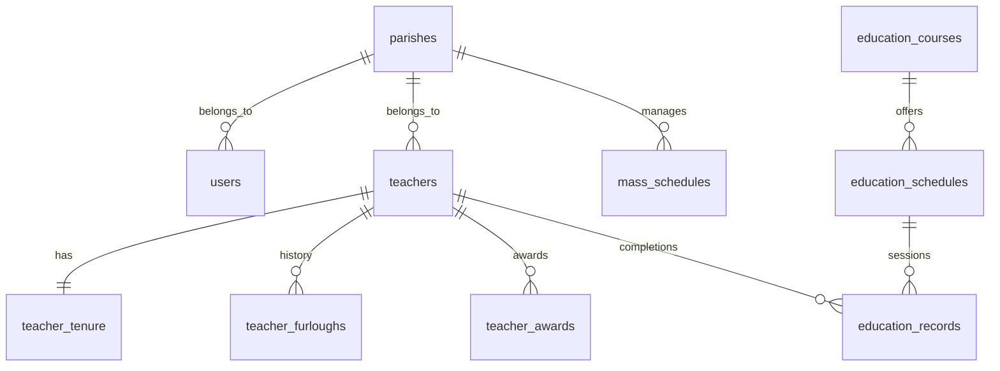

# [Design] 차세대 CTMS 데이터베이스 스키마 (v2)

기존 레거시 DB의 파편화와 중복을 제거하고, 리뉴얼 서비스의 성능과 확장성을 극대화하기 위한 새로운 DB 설계안입니다.

## 1. 데이터 모델 다이어그램 (ERD)

## 2. 주요 테이블 상세 설계

### [A] 조직 및 계정 (Organizations & Accounts)

#### 1. `parishes` (본당 마스터)
기존 `search_bondang`과 `ctms_user_info`의 상세 정보를 통합합니다.
- `id`: INT PK AI
- `diocese_name`: VARCHAR (대리구명)
- `diocese_code`: VARCHAR (대리구코드)
- `district_name`: VARCHAR (지구명)
- `district_code`: VARCHAR (지구코드)
- `parish_name`: VARCHAR (본당명)
- `parish_code`: VARCHAR UNIQUE (본당코드)
- `pastor_name`: VARCHAR (주임신부)
- `pastor_baptismal_name`: VARCHAR (세례명)
- `pastor_feast_day`: VARCHAR (축일)
- `spiritual_director_name`: VARCHAR (지도신부)
- `homepage_url`: VARCHAR
- `cafe_url`: VARCHAR
- `address_basic`: VARCHAR
- `address_detail`: VARCHAR
- `phone`: VARCHAR
- `fax`: VARCHAR

#### 2. `users` (시스템 사용자)
- `id`: INT PK AI
- `parish_id`: INT FK (parishes.id)
- `login_id`: VARCHAR UNIQUE
- `password_hash`: VARCHAR (보안 강화)
- `name`: VARCHAR
- `role`: ENUM ('office', 'diocese', 'bondang')
- `last_login_at`: DATETIME
- `created_at`: DATETIME

---

### [B] 교리교사 관리 (Teacher Management)

#### 3. `teachers` (교사 프로필)
`bd_member_right`와 `MPLUS_MEMBER_LIST`를 통합합니다.
- `id`: INT PK AI
- `parish_id`: INT FK (parishes.id)
- `login_id`: VARCHAR UNIQUE (계정 연동 키)
- `name`: VARCHAR
- `baptismal_name`: VARCHAR (세례명)
- `feast_day`: VARCHAR (축일)
- `birth_date`: DATE (생년월일)
- `gender`: ENUM ('M', 'F')
- `mobile_phone`: VARCHAR
- `home_phone`: VARCHAR
- `email`: VARCHAR
- `post_code`: VARCHAR
- `address_basic`: VARCHAR
- `address_detail`: VARCHAR
- `photo_path`: VARCHAR
- `department`: ENUM ('elementary', 'middle_high', 'daegun', 'disabled', 'integrated')
- `position`: VARCHAR (직책: 평교사, 교감 등)
- `status`: ENUM ('active', 'on_leave', 'retired')
- `current_grade`: VARCHAR (담당 학년)
- `remarks`: TEXT
- `created_at`: DATETIME
- `updated_at`: DATETIME

#### 4. `teacher_tenure` (근속 정보)
- `teacher_id`: INT PK FK (teachers.id)
- `start_year`: INT (근속 기준 연)
- `start_month`: INT (근속 기준 월)
- `offset_months`: INT (가감 월수)

#### 5. `teacher_furloughs` (휴직 이력 - 1:N 정규화)
- `id`: INT PK AI
- `teacher_id`: INT FK (teachers.id)
- `reason`: VARCHAR
- `start_date`: DATE
- `end_date`: DATE
- `remarks`: VARCHAR

#### 6. `teacher_awards` (수상 이력 - 1:N 정규화)
- `id`: INT PK AI
- `teacher_id`: INT FK (teachers.id)
- `award_type`: VARCHAR (근속상 등)
- `award_year`: INT
- `remarks`: VARCHAR

---

### [C] 교육 및 통계 (Education & Statistics)

#### 7. `education_courses` (교육 과정)
- `id`: INT PK AI
- `course_name`: VARCHAR
- `category`: VARCHAR (양성교육, 연수 등)

#### 8. `education_records` (수료 기록)
`bd_member_education`의 10개 슬롯 구조를 정규화합니다.
- `id`: INT PK AI
- `teacher_id`: INT FK (teachers.id)
- `course_id`: INT FK (education_courses.id)
- `completion_year`: INT
- `completion_date`: DATE
- `status`: VARCHAR (수료, 미수료)

---

## 3. 기존 DB -> 신규 DB 매핑 가이드

| 기존 테이블 (v1) | 신규 테이블 (v2) | 주요 변경 사항 |
| :--- | :--- | :--- |
| `search_bondang` + `ctms_user_info` | `parishes` | 본당 마스터 정보 통합 및 상세 필드 확장 |
| `MPLUS_MEMBER_LIST` (Admin) | `users` | 시스템 관리 계정으로 정제 |
| `bd_member_right` + `MPLUS_MEMBER_LIST` | `teachers` | 교사 인적사항 및 소속 정보 단일화 |
| `bd_member_csdate` | `teacher_tenure` | 근속 기준 데이터 분리 유지 |
| `bd_member_right` (reason/rsdt 컬럼) | `teacher_furloughs` | 고정 컬럼에서 1:N 이력 테이블로 정규화 |
| `tch_tml` | `teacher_awards` | 명확한 네이밍으로 변경 |
| `bd_member_education` (slots 1-10) | `education_records` | 고정 슬롯에서 1:N 이력 테이블로 정규화 |

## 4. 향후 마이그레이션 전략
1.  **Stage 1**: 실서버 DB 재이관 (v1 테이블 유지).
2.  **Stage 2**: `v2` 테이블 생성 및 `Internal Migration Script` 실행 (v1 데이터를 v2로 변환 삽입).
3.  **Stage 3**: 리뉴얼 서비스의 모델(Service 레이어)을 `v2` 테이블을 참조하도록 교체.
4.  **Stage 4**: 안정화 후 `v1` 테이블 및 레거시 전용 컬럼 제거.
