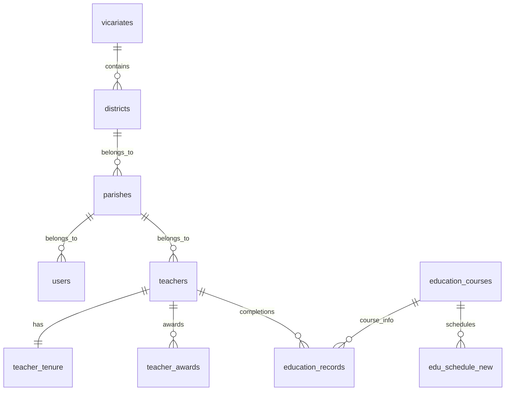

# [Design] 차세대 CTMS 데이터베이스 스키마 (v2)

기존 레거시 DB의 파편화와 중복을 제거하고, 리뉴얼 서비스의 성능과 확장성을 극대화하기 위한 새로운 DB 설계안입니다.

## 1. 데이터 모델 다이어그램 (ERD)

## 2. 주요 테이블 상세 설계

### [A] 조직 및 계정 (Organizations & Accounts)

#### 0. `vicariates` (대리구 마스터)
- `id`: INT PK AI
- `name`: VARCHAR (대리구명)
- `code`: VARCHAR UNIQUE (대리구코드: V1, V2 등)

#### 0.1 `districts` (지구 마스터)
- `id`: INT PK AI
- `vicariate_id`: INT FK (vicariates.id)
- `name`: VARCHAR (지구명)
- `code`: VARCHAR UNIQUE (지구코드: A, B 등)

#### 1. `parishes` (본당 마스터)
기존 `search_bondang`과 `ctms_user_info`의 상세 정보를 통합합니다.
- `id`: INT PK AI
- `district_id`: INT FK (districts.id)
- `parish_name`: VARCHAR (본당명)
- `parish_code`: VARCHAR UNIQUE (본당코드)
- `diocese_name`: VARCHAR (대리구명 - 호환용)
- `district_name`: VARCHAR (지구명 - 호환용)
- `address_basic`: VARCHAR
- `phone`: VARCHAR (내선번호 - ORG_IN_TEL)
- `org_out_tel`: VARCHAR (국선번호 - ORG_OUT_TEL)
- `fax`: VARCHAR (팩스번호)

#### 2. `users` (시스템 사용자)
- `id`: INT PK AI
- `parish_id`: INT FK (parishes.id)
- `login_id`: VARCHAR UNIQUE
- `password_hash`: VARCHAR (보안 강화)
- `name`: VARCHAR
- `role`: ENUM ('casuwon', 'diocese', 'bondang')
- `org_in_tel`: VARCHAR (내선번호)
- `org_out_tel`: VARCHAR (국선번호)

---

### [B] 교리교사 관리 (Teacher Management)

#### 3. `teachers` (교사 프로필)
- `id`: INT PK AI
- `parish_id`: INT FK (parishes.id)
- `name`: VARCHAR
- `baptismal_name`: VARCHAR (세례명)
- `birth_date`: DATE
- `status`: ENUM ('active', 'on_leave', 'retired')

#### 4. `teacher_tenure` (근속 정보)
- `teacher_id`: INT PK FK (teachers.id)
- `start_year`: INT
- `start_month`: INT
- `offset_months`: INT

#### 5. `teacher_awards` (수상 이력)
- `id`: INT PK AI
- `teacher_id`: INT FK (teachers.id)
- `award_type`: VARCHAR
- `award_year`: INT

---

### [C] 교육 기록 (Education Records)

#### 6. `education_courses` (표준 교육 과정)
- `id`: INT PK AI
- `course_name`: VARCHAR UNIQUE (정규화된 과목명)
- `category`: VARCHAR (카테고리: 영성, 교리, 기능 등)
- `is_active`: TINYINT (활성/비활성)

#### 7. `education_records` (수료 기록)
- `id`: INT PK AI
- `teacher_id`: INT FK (teachers.id)
- `course_id`: INT FK (education_courses.id)
- `completion_year`: INT

---

### [D] 교육 일정 (Schedules)

#### 8. `edu_schedule_new` (교육 일정 관리)
- `idx_num`: INT PK AI
- `course_id`: INT FK (education_courses.id)
- `edu_subject`: VARCHAR (구체적인 일정 명칭)
- `edu_year`: VARCHAR (연도)
- `edu_date`: DATETIME (일시)
- `edu_place`: VARCHAR (장소)
- `edu_level`: VARCHAR (대상: 0:통합, 1:초등, 2:중고등)
- `edu_state`: VARCHAR (상태: 0:예정, 1:접수, 2:교육중, 3:종료)
- `edu_money`: VARCHAR (참가비)
- `edu_maxp`: INT (정원)
- `edu_content`: TEXT (상세 내용)

---

## 3. 기존 DB -> 신규 DB 매핑 가이드

| 기존 테이블 (v1) | 신규 테이블 (v2) | 주요 변경 사항 |
| :--- | :--- | :--- |
| `search_bondang` | `parishes`, `vicariates`, `districts` | 조직 체계 정규화 및 자동 생성 |
| `ctms_user_info` | `users` | `ctms_ucode`를 사용한 정확한 본당 매핑 |
| `bd_member_right` | `teachers` | 교사 기본 정보 이관 |
| `bd_member_csdate` | `teacher_tenure` | 근속 산정 기준 데이터 |
| `tch_tml` | `teacher_awards` | 수상 이력 정규화 |
| `bd_member_education` | `education_records` | 슬롯 구조를 1:N 이력 구조로 변환 |

## 4. 마이그레이션 세부 로직 (`Migrator.php`)

### 4.1 조직 및 계정 연결
- **조직 자동 생성**: 본당 데이터를 분석하여 대리구/지구 마스터 정보를 자동으로 채우고 관계를 설정합니다.
- **계정-본당 매핑**: `ctms_ucode`를 매핑 키로 사용하여 본당 계정의 소속을 정확히 지정합니다.

### 4.2 데이터 무결성 보장
- **Collation**: JOIN 시 발생할 수 있는 콜레이션 오류를 `COLLATE` 문으로 해결했습니다.
- **중복 방지**: 교육 과정 및 지구 코드 등에 `UNIQUE` 제약 조건을 설정하고 `REPLACE INTO`를 활용합니다.
- **Y2K 보정**: 1900년대 데이터를 2000년대로 자동 보정 처리합니다.

## 5. 최종 점검 사항
- 관리자 계정: `admin1004` / `casuwon`
- 본당 검색: 모달 창 기반 AJAX 통합 검색 적용 완료
- 근속/수상: 탭 메뉴에서 정상 노출 확인 완료
